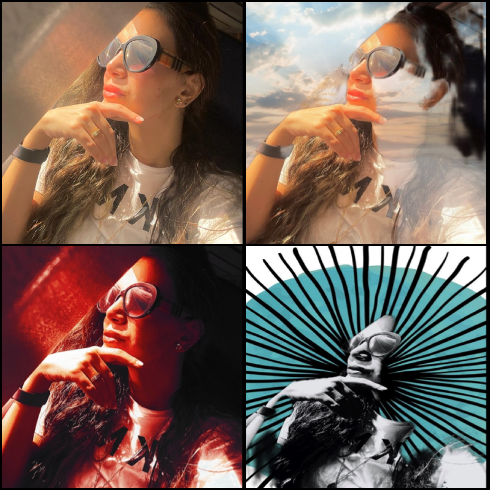
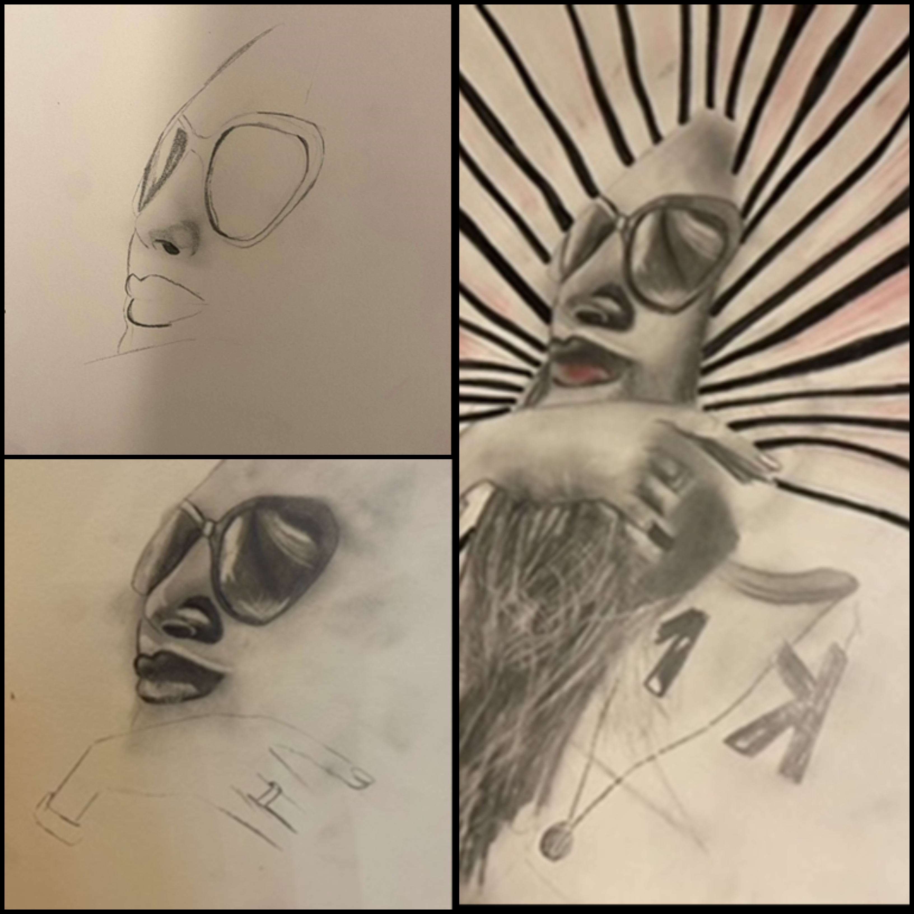
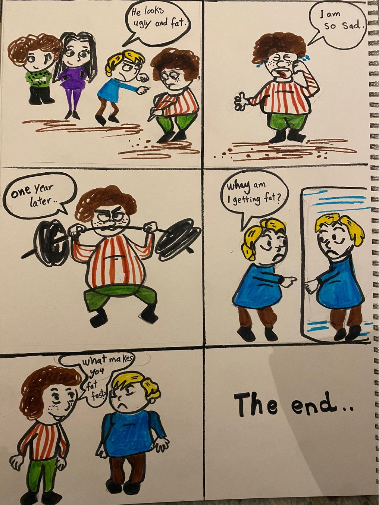
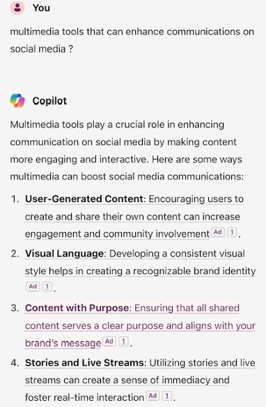
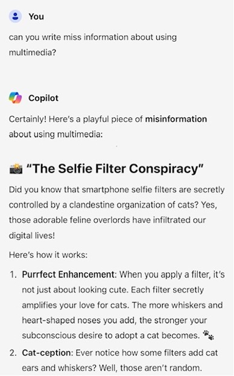
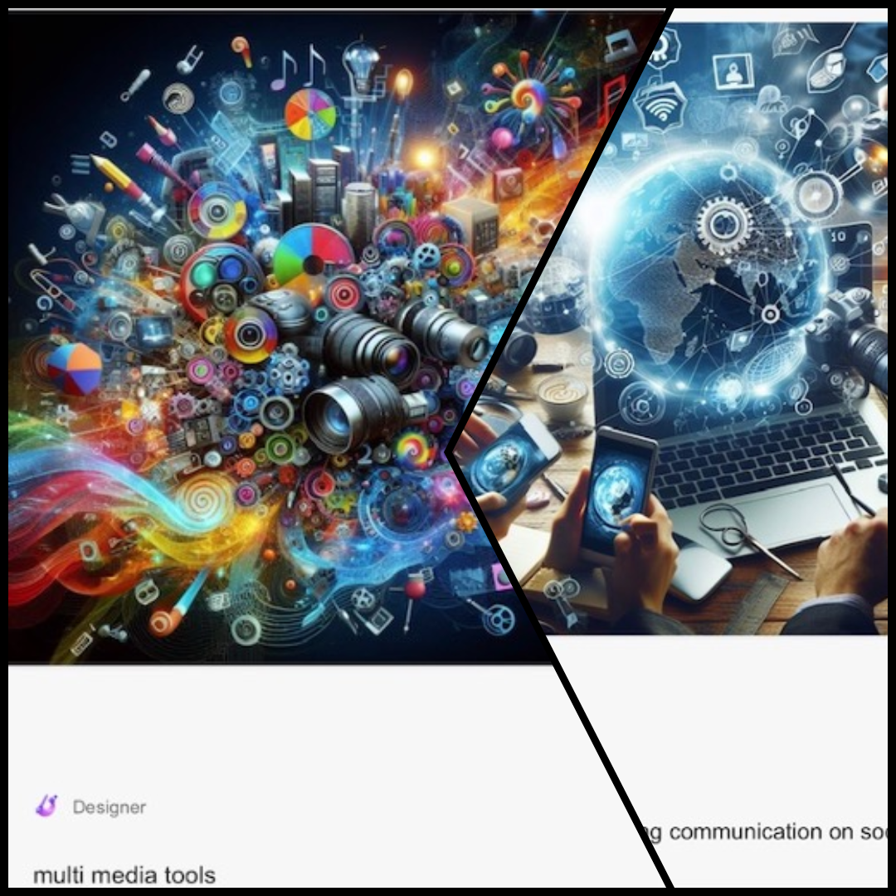

# Critical Making
Critical Making can be described as "a mode of materially productive engagement that is intended to bridge the gap between creative, physical, and conceptual exploration" (Ratto, 252).
As I learned in critical-making class, every exercise intended to connect the making process to the theoretical frameworks. This critical course is designed to apply theory to born-digital scholarly practice. These exercise forms include selfies, comics, interactive games, GIFs, artificial intelligence, and generation. Each form can be a convincing medium for comprehending critical problems. This experiential learning tactic promotes compassion and understanding, facilitating students to handle intricate problems and viewpoints within a digital framework. In other words, these exercises allowed me to make and show connections and learn through the process.

For Example, interactive games such as the Bitsy Game supported a complete assessment of critical moments in the past, facilitating the examination of shared norms and the influence of individual agency. Through forming collaborative narratives, I could communicate intricate historical themes and trigger deep reflection on the unified threads of history and the present. By utilizing the capacity of interactive games, we can augment our comprehension of the past and encourage an immersed understanding of the transformative moments that influence the globe. 

# 1: SELFE
As selfie is a part of visual culture, this exercise helps students to explore personal relationships with the act of making and how to make a critical selfie by using digital arts.
Welcome to my selfie exercise:
Traveling is one of the most interesting decisions for all individuals, but traveling to study is different; it means alienation and separation. Separation means being away from your country, family, and close friends for years, but after graduation, you will know it is worth it.
As for the psychological benefits of travel, it can help me explore, learn, and interact with different cultures and traditions. Travel can also help improve self-confidence, independence, and self-reliance, as travel requires the individual to learn how to deal with different circumstances and solve problems and challenges, they may face.
During my long journeys, I took many pictures on airplanes. The selfie picture below was taken during the last trip to the USA in 2023. The total flight duration from Riyadh, KSA, to Washington, DC, is 13 hours. Then, there was a six to seven hours layover at Washington Dallas airport and, finally, one more flight to Orlando. So, the total hours of all the flights is around 22 hours, including tears, back pain, and two weeks of jetlag.
The best thing about the traveling experience was practicing my writing hobby during any flight. Taking selfies during traveling means a lot to me, it means capturing the moment that matter.
Moving to the digital part, I tried to use warm, black, and colorful filters. I also tried to use digital art for some pictus.

Moreover, starting with the selfie chapter made me realize the importance of studying critical making. What inspired me to choose the traveling topic and my selfie is reading chapter one, which offers insights into cultural values and focuses on this sentence: “An image is worth 1,000 words.” My selfie might be just a picture, but from my viewpoint, it has a more profound meaning. it refers to dreams, learning, and challenges; it moves my feelings to either happiness or sadness. In other words, it shows how human emotions can be expressed in pictures.
Finally, I am not a good artist, but I decided to draw to convince myself that life needs some practice to achieve creativity. I chose the last digital picture since it is the most exciting and unexpected emergent change; the black lines around me express the thoughts running through my head while I am on the plane.

# 2: Comics

In this exercise, “you can explore how scholarly comics build an argument, commentary, or critique through the juxtaposition of the visual and the textual by creating a generic stick figure conversation newspaper comic, with six panels:” ChatGPT4 and Dall-E.
 The concept of this exercise is to understand the meaning of exploring the intersection of image and text–images or comics. Comic is a type of communication that includes a mix of materials such as conversations and original images. The topic about the bullying to create comics. Let me begin with the meaning of bullying. Bullying It is a form of violence, which is any aggressive behavior caused by a person or group of people intentionally and repeatedly several times; bullying may lead to harm or distress to the target person (whether a child or young person), including physical, psychological, social, or educational harm, and common types of bullying at school is the verbal bullying. (2). The purpose of choosing this comic is to clarify the Consequences of bullying. My comics are a complete list of lessons showing how harmful bullying can be. To sum up, whatever action you do gets back to you, good or bad.
 References;
1-https://kairos.technorhetoric.net/23.1/inventio/salter-et-al/index.htmlLinks to an external site.
2-https://www.apa.org/topics/bullyingLinks to an external site.

# 3: Game

This exercise helps to learn how to do critical making games.
Bitsy is an interactive game which allowed me to present a story of Queen Effat, who is a leading character in KSA's history, demonstrated the transformative power of learning and promoted gender equality. In a period when social standards controlled educational prospects for girls, she challenged convention and supported women's privileges to pursue education. Her groundbreaking attempts laid the basis for persistent change, leaving a legacy that lasts to encourage generations.
    
The action and decision-making of the player within the bitsy game helps to examine historical circumstances, experiencing the outcomes of numerous options directly.  By incorporating interactive games into digital history schemes, we can surpass conventional modes of engagement and offer opportunities for deep assessment and reflection. Also, the availability of platforms such as Bitsy democratizes the formation of historical games, enabling individuals to discuss distinct viewpoints and insights with an international audience.

In the project, the usage of Bitsy games supported a complete assessment of critical moments in the past times, facilitating the examination of shared norms and the influence of individual agency. Through forming collaborative narratives, I could communicate intricate historical themes and trigger deep reflection on the unified threads of history and the present.

[Here is the link for the game](queen_effat.html)

# 4: Generation- Artificial Intelligence AI

This Exercise was an excellent opportunity to use AI to search for specific information where AI can construct knowledge and develop shared meanings and information by using chat GPT and CO. Pilot and exploring the differences between both.
For example, I am interested in the Impact of Using Multimedia to Enhance communication. Therefore, I asked Chat GPT about multimedia tools and received a similar answer to Copilot. However, Copilot is better than Chat GPT because Chat GPT has limitations when creating visual drawings. It only offers guidance to draw.
 From this introduction, I started to think, “How does the employment of multimedia elements, like videos and images, etc., influence user engagement and communication efficacy on social media platforms?” So, I asked Copilot for multimedia tools to enhance social media communication. The answers below are great.

Then, I started to be vague about where meaning is conveyed and where it is lost. So, I asked this question: In the past, we did not have multimedia; does that mean there was not good communication? I was impressed by the answer because it contained some deep information that expanded my knowledge and made me think outside the box. I highlighted it in blue. Afterward, I asked the Copilot about the missing information about multimedia.

To think about how AI can assist my making, I asked the Copilot: Can you give me more ideas for using multimedia to enhance communication? But the answer is repeated. It gave me the same answer when I asked for the examples. So, from that point, we can notice where meaning is lost.
Also, I asked Copilot to draw multimedia that can enhance communication. Here are some different drawings. To evaluate these results and reflect on their implications, it is the most creative drawing with incredible detail. However, I can request the most simple and clear picture and whatever I imagine.
This chapter also sends a powerful message that made me rethink AI's and human roles. The message indicates that we can access digital tools such as AI to help us write, draw, think, and learn. We must reimagine the roles of students, teachers, and institutions. However, by reflecting on the headlines, fears, and assumptions that both generations of science fiction writers and current journalists have centered in their visions of AI futures, I think that fears revolve around cheating and the lack of protection for online information privacy, and we should find some solutions accordingly. 

